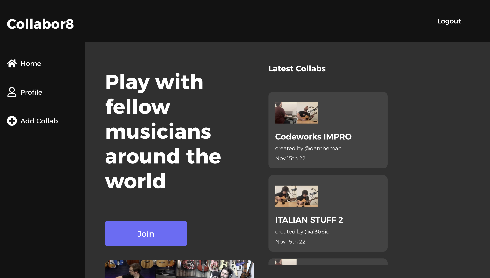
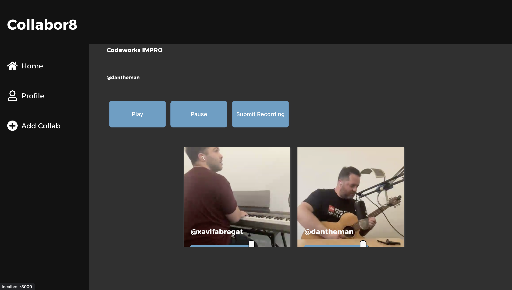

# Collabor8: A platform for musicians to record and collaborate online

Collabor8 is a Web App that allows musicians from around the world to record and share tracks, creating a platform for collaboration and creating new music. With Collabor8, users can record their own tracks and add them to existing tracks to create covers or original collaborations.

## Tech Stack

The project uses: <br>
Express with Typescript <br>
MongoDB with Mongoose <br>
React with Typescript <br>

On top of that it uses Cloudinary to store media, so if you want to run it you'll have to register and place the keys on the .env files

## Alpha views, subject to change

<p>
  
  
</p>

## Getting Started

To get started with Collabor8, fork this repo and run 
<br>
<br>
```npm install``` 
<br>
<br>
both in the /server and the /client folders.

Then, create a .env file for the Client folder, that holds your keys to connect to Cloudinary to save your collab tracks and track pictures, following this format:
<br>
<br>
```REACT_APP_CLOUDINARY_UPLOAD_URL = https://api.cloudinary.com/v1_1/XXXXXXXXX/upload```<br>
```REACT_APP_CLOUDINARY_PRESET = XXXXXXXX```
<br>
<br>

After that, go to the /src folder and run ```tsc``` to run the Typescript compiler. Once it's finished, just head to the /build folder and run the index file either by typing ```node index.js``` or running ```nodemon``` to dynamicaly restart the server when there's changes.

## Additional Information

Please note that Collabor8 is currently in Alpha and may have some bugs or limitations. If you encounter any issues, please report them on our GitHub page so that we can address them. We welcome contributions to the project, so if you have ideas or suggestions, feel free to open a pull request on our GitHub repository.
